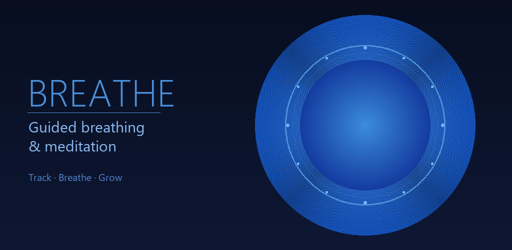
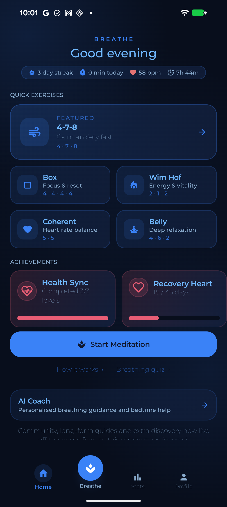
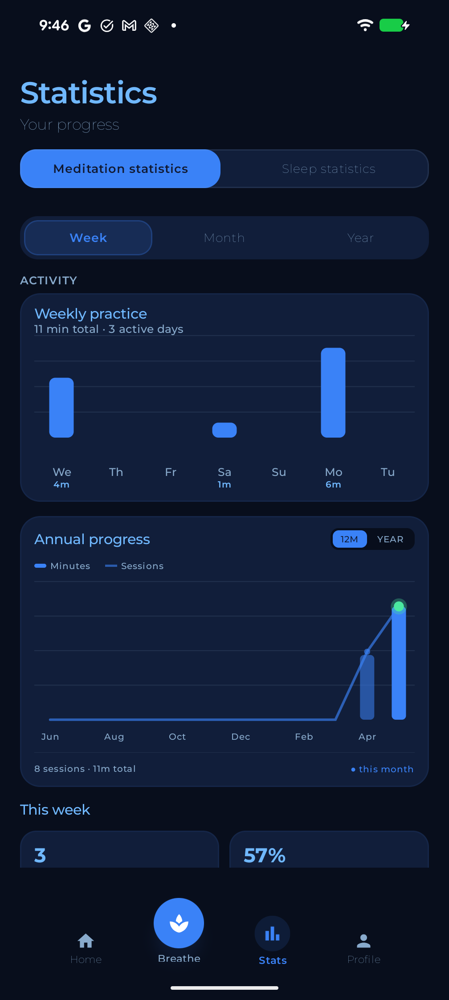
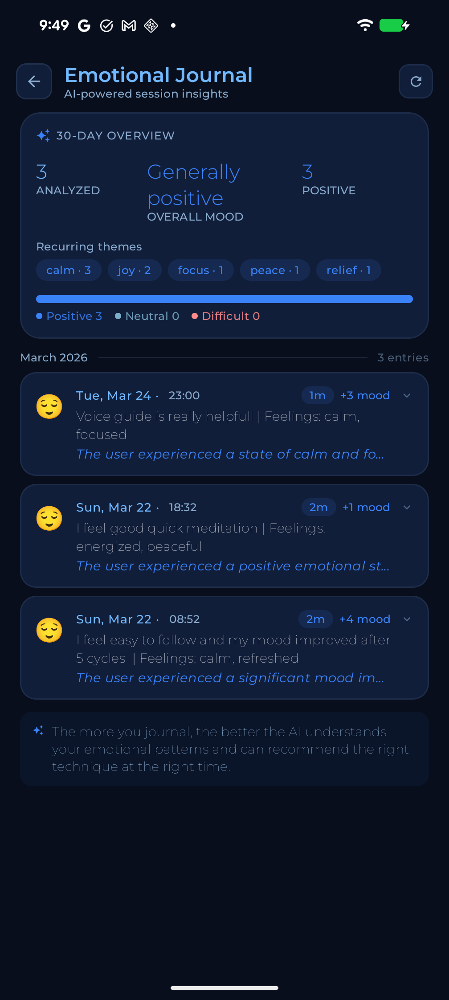
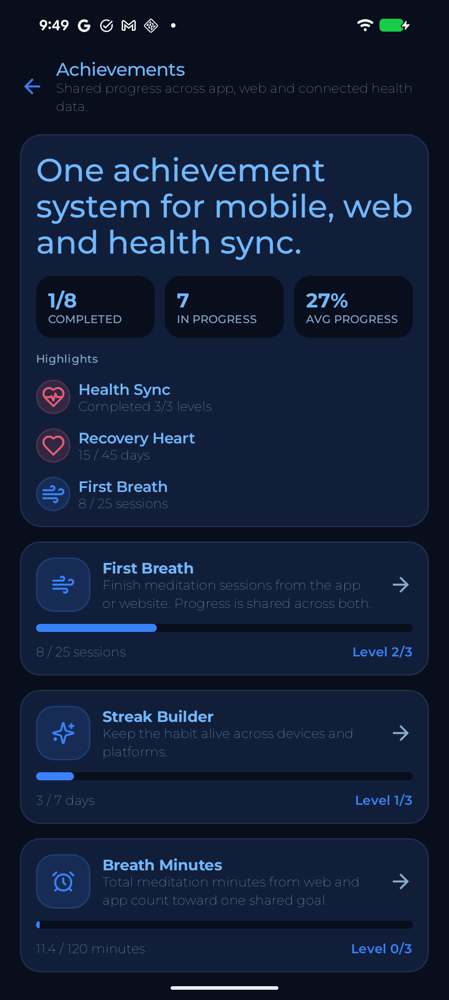
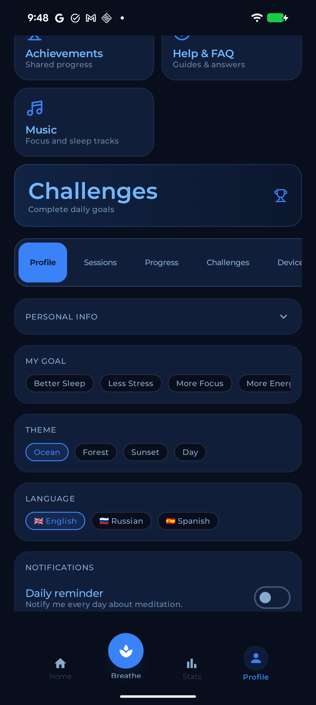

<p align="center">
  
</p>

<h1 align="center">Breathe</h1>

<p align="center">
  Guided breathing & meditation app with AI coaching, health-data sync, and progress tracking.
</p>

<p align="center">
  
  
  
  
  
</p>

---

## Screenshots

| Home | Statistics | AI Journal | Achievements | Profile |
|:---:|:---:|:---:|:---:|:---:|
|  |  |  |  |  |

## Features

- **7 breathing techniques** — 4-7-8, Box, Coherent, Wim Hof, Belly, Alternate Nostril, Morning — plus fully custom rhythms, driven by an animated breathing circle with haptic phase transitions and optional voice guidance
- **Session tracking** — history with mood & focus ratings, streak counter, weekly / annual progress charts
- **Sleep analytics** — hypnogram, sleep-stage donut, sleep score trends, and locally computed insights from Health Connect data
- **AI coach & emotional journal** — NLP-analyzed journal entries and personalized technique recommendations
- **Health Connect integration** — read-only heart rate, resting HR, respiratory rate, sleep, and steps from wearables (Amazfit, Xiaomi, Samsung)
- **Achievements & challenges** — level-based milestones synced across mobile and web via a shared backend
- **Community globe** — share meditation spots and posts with other users
- **Meditation music** — ambient track library with a global mini-player
- **Localization** — English, Russian, Spanish (650+ strings per locale); light & dark themes
- **Offline-first** — sessions are stored in Room immediately and synced to the REST API in the background via WorkManager

## Architecture

MVVM with a unidirectional data flow, structured into three layers:

```
ui/          Jetpack Compose screens + Navigation Compose (50 screens/components)
viewmodel/   18 ViewModels exposing StateFlow<UiState>
data/
  api/       Retrofit2 + OkHttp3 (JWT auth interceptor, 401 auto-logout)
  local/     Room database + DAOs, DataStore preferences
  repository/ Single source of truth, offline-first sync
worker/      WorkManager background sync (Hilt-injected workers)
```

**Key technical decisions**

- **DI:** Hilt everywhere — ViewModels, Workers (`HiltWorkerFactory`), OkHttp/Retrofit singletons
- **Auth:** Google Sign-In via Credential Manager + email/password; JWT stored in `EncryptedSharedPreferences` (AES-256-GCM) with graceful recovery after backup/restore
- **Networking:** cleartext HTTP blocked by Network Security Config; request/response logging in debug builds only
- **Release hardening:** R8 minify + resource shrinking, `Log.d/v` stripped via ProGuard `assumenosideeffects`, backup rules exclude auth tokens
- **Resilience:** nullable API models with computed fallbacks (Gson bypasses Kotlin null-safety — every remote field is treated as untrusted)

## Tech Stack

| Layer | Libraries |
|---|---|
| UI | Jetpack Compose (BOM 2025.05), Material 3, Navigation Compose, Coil, Lucide icons |
| State | ViewModel + StateFlow, Lifecycle KTX |
| DI | Hilt (+ hilt-work, hilt-navigation-compose) |
| Data | Room, DataStore Preferences, EncryptedSharedPreferences |
| Network | Retrofit 2, OkHttp 3 (BOM), Gson |
| Background | WorkManager, AlarmManager (daily reminders, boot-persistent) |
| Health | Health Connect Client |
| Auth | AndroidX Credentials + Google Identity |
| Testing | JUnit 4, kotlinx-coroutines-test |

## Getting Started

1. Clone the repo and open in Android Studio (Ladybug or newer, JDK 17+)
2. Create `local.properties` entries (optional — app runs without them):
   ```properties
   GOOGLE_WEB_CLIENT_ID=<your-oauth-web-client-id>
   ```
3. Build and run:
   ```bash
   ./gradlew assembleDebug
   ```

The app talks to a companion REST API (`https://breathe-api-amut.onrender.com`). The free-tier server sleeps when idle, so the first request after a long pause may take ~30 s.

> **Windows note:** if Gradle fails with "Unable to establish loopback connection" on JDK 21, prefix builds with `JAVA_TOOL_OPTIONS="-Djdk.net.unixdomain.tmpdir=C:/Temp"` (JDK bug with 8.3 short paths in the socket directory).

## Testing

```bash
./gradlew testDebugUnitTest
```

56 unit tests cover breathing-preset integrity, streak/BMI/session calculations, sleep aggregation, music cache, and integration-repository logic.

## Release

Signed AAB (Play App Signing) — see [RELEASE_CHECKLIST.md](RELEASE_CHECKLIST.md). Signing config is read from `local.properties`; the keystore is never committed.
